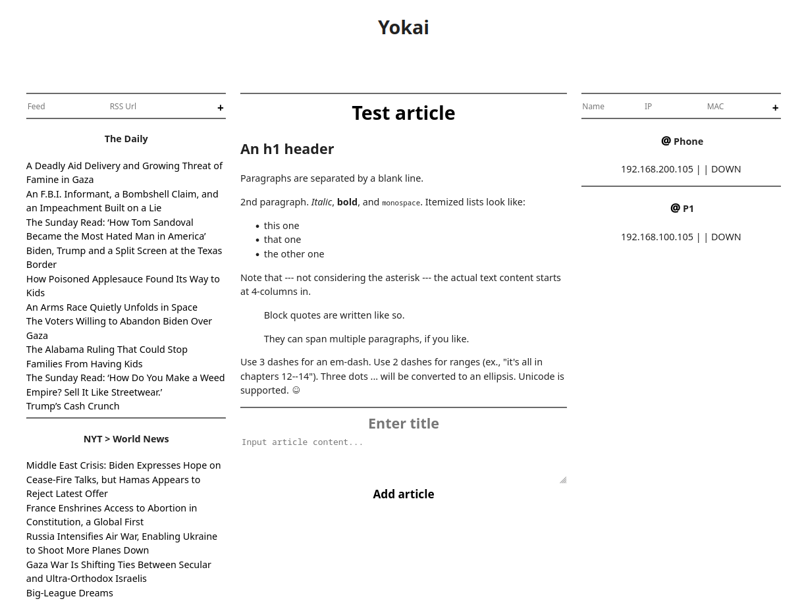

# YOKAI HOME UI

An extremly minimal dashboard

It allows for managing RSS feeds, Markdown based articles and network devices allowing checking their status as well as waking them via Wake-on-LAN



### Prerequisites

You need to have those installed:
- nodejs
- npm
- bun

### Usage

```bash
bun run --bun vite
```

For instructons use 
```bash
bun --help
```